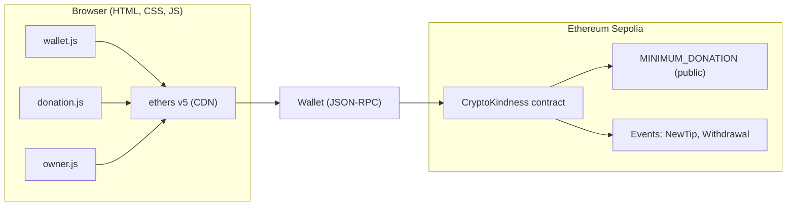

# CryptoKindness

**Goal:** ship a usable donation dApp, learn the raw edges of Web3 frontends, and document what frameworks would later improve.

**Network:** Sepolia

**Contract Address:** 0x016583Cd6201A461A32febf0ABe4F33927135869

**Stack:** HTML, CSS, JavaScript, ethers@5 via CDN

**Live demo:**  

**Screenshots:**  

## Why vanilla first
I chose vanilla HTML, CSS, and JavaScript to show I can build a working Web3 product without leaning on a framework. That means hand rolling DOM updates, wiring wallet connections, handling async transaction states, and reading or writing on chain directly with ethers@5.

From a learning standpoint, I wanted to feel the friction points first: state management, component reuse, error boundaries, cache and connectors. That way I can appreciate exactly what React, wagmi, and viem will improve when I migrate. The result is both a portfolio piece that proves core skills and a baseline that makes future framework upgrades intentional, not trendy.

## Skills used and skills learned
**Smart contract integration**
- Consumed a live ABI in the browser and called payable methods with value

- Read public variables and mapped reads for balance and donor totals

- Handled custom errors like DonationTooSmall, ZeroAmount, InsufficientBalance

- Used events (NewTip, Withdrawal) as the transparency layer for future indexing

**Frontend engineering (vanilla)**

- Wrote modular browser code: wallet.js, donation.js, owner.js, utils/constants.js

- Implemented form validation that mirrors contract rules

- Managed async UX for connect, sign, pending, success, and failure states

- Built a small design system in CSS with shared variables and page level styles

**Web3 UX**

- Network guardrails for Sepolia with clear feedback when on the wrong chain

- Copy to clipboard patterns for addresses and transaction hashes

- Minimum donation UX that matches the on chain constant

**Security and correctness**

- Owner only withdrawal flows with visible checks in the UI

- Defensive reads and try or catch around provider, signer, and contract calls

- Gas limit defaults with room to adjust in config

**Dev and shipping**

- Zero build static hosting that can deploy to GitHub Pages, Vercel, or Netlify

- Config isolation in constants.js so redeploys do not require code changes

- Clear repo map and quick start for reviewers

## Architecture


## Repo structure
<details>
  <summary>Repository Structure</summary>

  <pre><code>cryptokindness/
├─ .gitignore
├─ frontend/
|  ├─ README.md
|  ├─ .gitignore
|  ├─ package-lock.json
|  ├─ package.json    
│  ├─ public/
│  │  ├─ index.html
│  │  ├─ about.html
│  │  ├─ impact.html
│  │  ├─ donate.html
│  │  └─ owner.html
│  └─ src/
│     ├─ css/
│     │  ├─ main.css
│     │  ├─ home.css
│     │  ├─ about.css
│     │  ├─ impact.css
│     │  ├─ donate.css
│     │  └─ owner.css
│     └─ js/
│        ├─ app.js
│        ├─ wallet.js
│        ├─ donation.js
│        ├─ owner.js
│        └─ utils/
│           └─ constants.js
└─ smart-contracts/
   ├─ README.md
   ├─ contracts/
   │  └─ TipJar.sol
   |  └─ interfaces/
         └─ ITipJar.sol
   ├─ scripts/
   │  ├─ deploy.ts
   ├─ test/
   │  └─ TipJar.test.ts
   ├─ hardhat.config.ts
   ├─ package.json
   ├─ package-lock.json
   └─ .gitignore</code></pre>

</details>

 
## Key decisions

**Frontend stack: vanilla**
Reason: feel manual DOM, state, error handling, and raw ethers calls before adopting a framework.
Tradeoff: more boilerplate and lower DX.
Future: migrate to React with wagmi and viem once the fundamentals are fully clear.

**Validation: UI and contract**
Reason: keep UX friendly with a visible minimum in the UI and final enforcement on chain with MINIMUM_DONATION.
Tradeoff: a small rule exists in two places.
Future: make the minimum configurable on chain and read it at runtime in the UI.

**Ownership: single owner**
Reason: keep scope small and show withdrawals cleanly.
Tradeoff: single point of failure.
Future: swap to a multisig for production safety.

**Transparency: events only**
Reason: keep infra simple while preserving an auditable log of donations and withdrawals.
Tradeoff: no dashboards yet.
Future: add a Subgraph and build donor and cause analytics.

## What works now

- Donate to a cause with an optional message

- UI minimum and on chain minimum are in sync

- Owner can withdraw a specific amount or withdraw all

- Clear errors for small donations and low balances

## Quick start
```
git clone https://github.com/your-user/cryptokindness.git
cd cryptokindness

npx serve public
npx serve .
```
Open `donate.html` to try a donation. Open `owner.html` for the owner dashboard.

Configure: edit `src/js/utils/constants.js`

`CONTRACT_ADDRESS` — paste your deployed address

`NETWORK_CONFIG` — set Sepolia RPC URL and block explorer

`MIN_DONATION_ETH` — keep aligned with the contract  `MINIMUM_DONATION`


## Files that matter

`wallet.js` — connect flow and network checks

`donation.js` — validates amount and calls `donate(message)` with `value`

`owner.js` — reads balance, supports `withdraw(amount)` and `withdrawAll`

`utils/constants.js` — ABI, address, network config, any UI copy

`main.css` and page CSS — shared theme and page styling

`index.html`, `about.html`, `impact.html`, `donate.html`, `owner.html` — pages

## Contract surface used by the app

Read:

`MINIMUM_DONATION() view returns (uint256)`

`getBalance() view returns (uint256)`

`owner() view returns (address)`

`totalDonations(address donor) view returns (uint256)`

Write:

`donate(string message) payable`

`withdraw(uint256 amount)`

`withdrawAll()`

Events:

`NewTip(address indexed donor, uint256 amount, string message, uint256 timestamp)`

`Withdrawal(address indexed owner, uint256 amount, uint256 timestamp)`

Errors:

`DonationTooSmall()`

`ZeroAmount()`

`InsufficientBalance()`

`TransferFail()`

Constructor:

`(address initialOwner)`

## Known limits

- No multisig yet for withdrawals

- No Subgraph or analytics dashboard yet

- No ERC20 donations yet

- Static frontend with vanilla JS

## Planned

- Multisig owner

- Per cause routing and analytics

- ERC20 donations with price feeds

- Subgraph for transparent dashboards

- React migration with wagmi for a smoother UX


